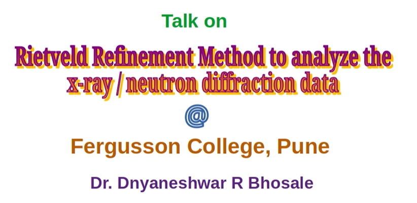
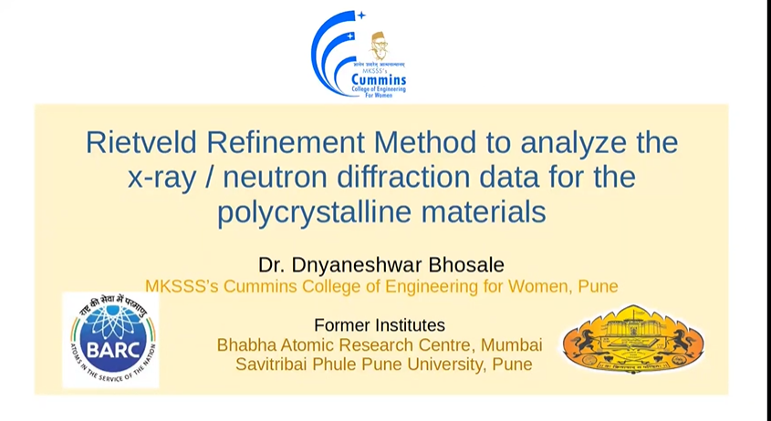
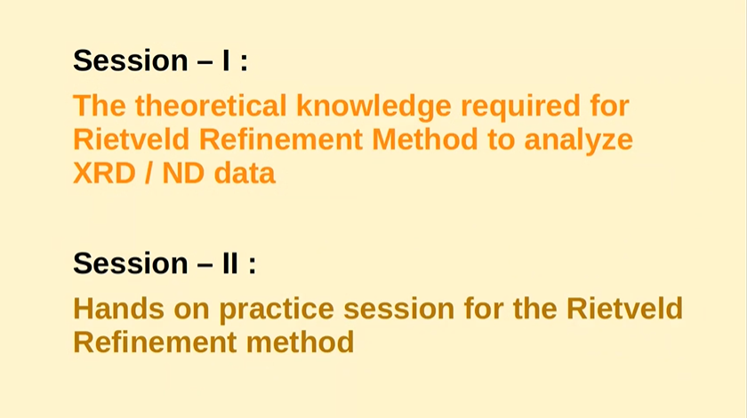
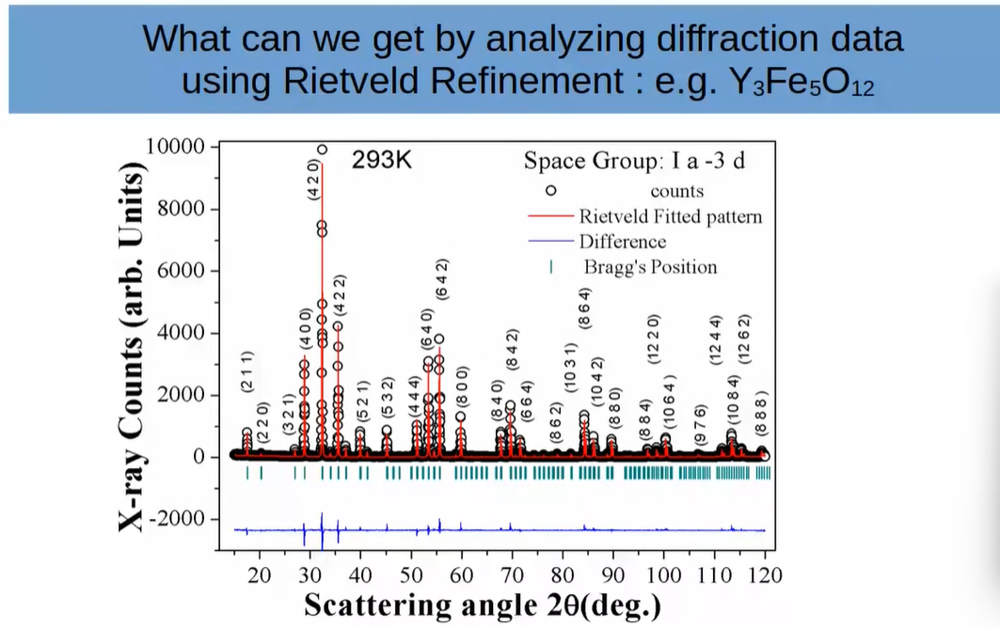
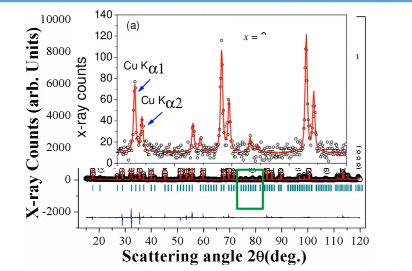
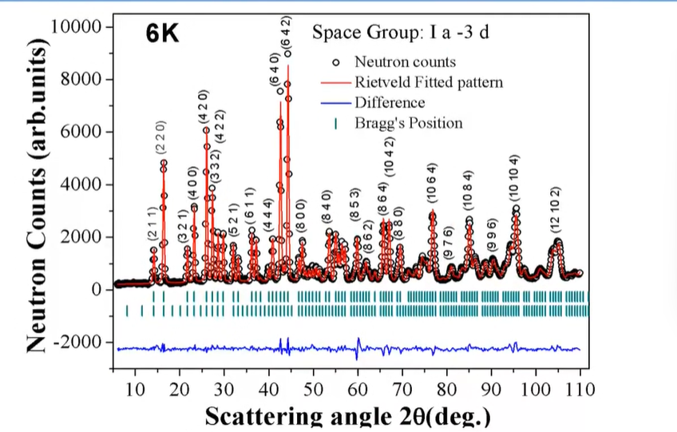
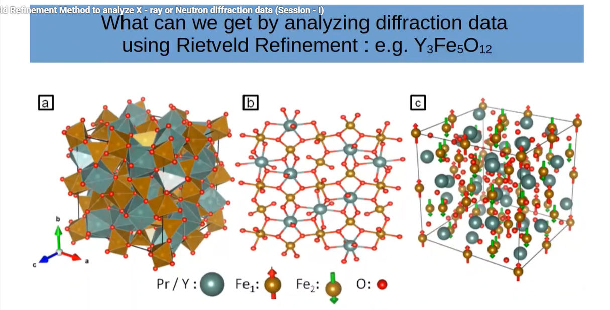
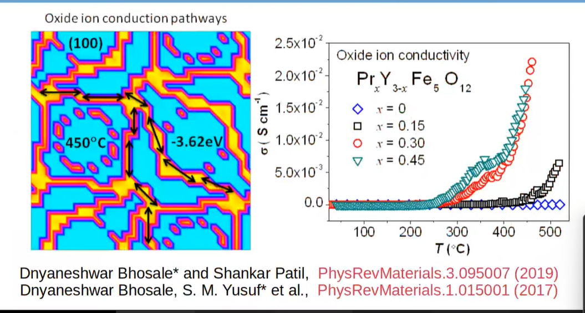
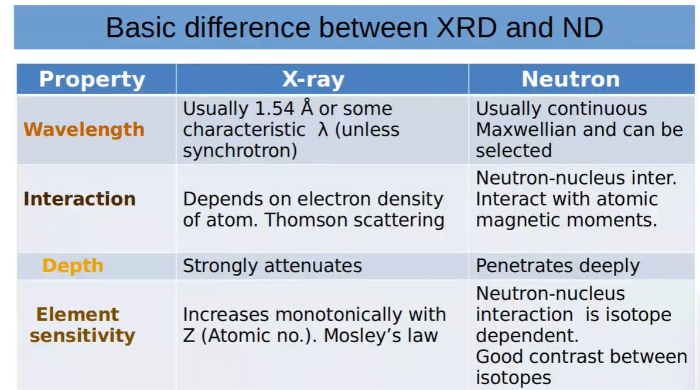
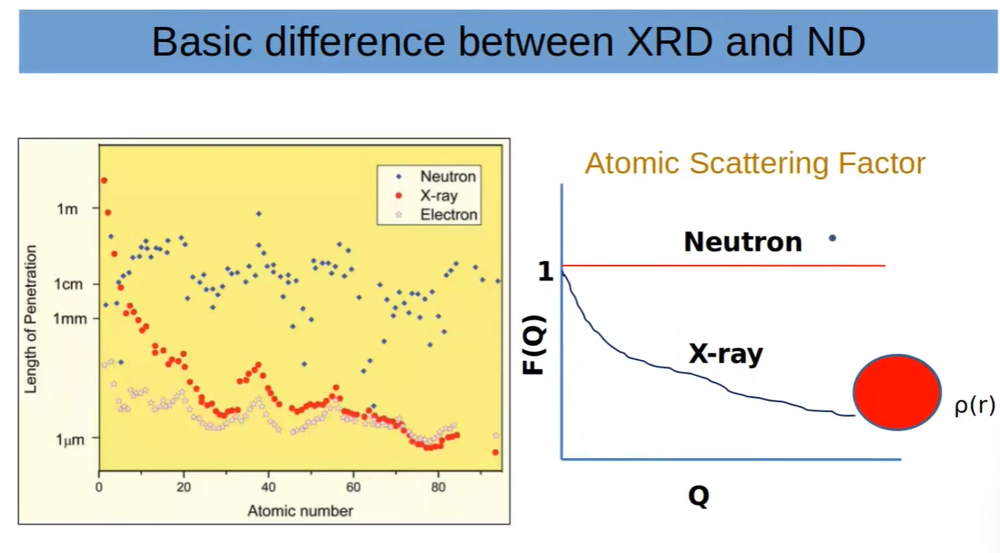

# Rietveld Refinement Method to analyze X - ray or Neutron diffraction data (Session - I)

> So this method is basically a computational techniques. So we dig out a lot of information from X-ray diffraction pattern and neutron diffraction pattern for polycrystalline or single crytalline material  
> And in session 2, basically we'll be using that computational techniques. So we'll be having hands on session - like we will be having data and we'll be having some structural model.  
> Then basically we'll be fitting our data with the structural model and we'll be generating a lot of information  

## What can we get by analyzing diffraction data using Rietveld Refinement  

> All of you know that those who are working in material science very basic technique is X-ray diffraction  
> So if you are synthesizing polycrystalline materials or single crystalline materials, we have do X-ray diffraction and then we analyze that data  
> So by analyzing that data we can extract many more information  
> People used to say X-ray diffraction is a crude technique  
> But now a days synchrotron radiation is avialable. So we can do X-ray diffraction using synchrotron radiation  
> And we can also do neutron diffraction.  

> So whatever data we get it is like a nonlinear function  
> So one has to have some standard technique  
> So Rietveld refinement is very basic computational tool so that to dig out a lot of information from the X-ray diffraction data or neutron diffraction data  

* Lattice Parameters
* Atomic Positions
* Atomic Occupancy
* Crystalline Size
* Thermal parameters
* Bond angle - Bond length
* Phase transitions
* Quantitative phase analysis
* Crystal structure(FCC, Hexagonal, Orthorhombic etc)
* Magnetic structures(with Neutron data)
* Electron density
* Ionic transport pathways

## What can we get by analyzing diffraction data using Rietveld Refinement e.g. Y₃Fe₅O₁₂

Circles are observed data  

We are trying to match structural model with our observed data

> The green ones are bragg position   
> If you see somewhere you don't have a green line(vertical bar) but you are having a peak, it means you are having a impurity in your sample. So you can simply recognize that  

> The lower vertical bar is basically position for magnetic peak in case of neutron diffraction

> So once we refine pattern, so this beautiful chemical structure you can visualize once you have output files  

## Basic Difference between XRD and ND

