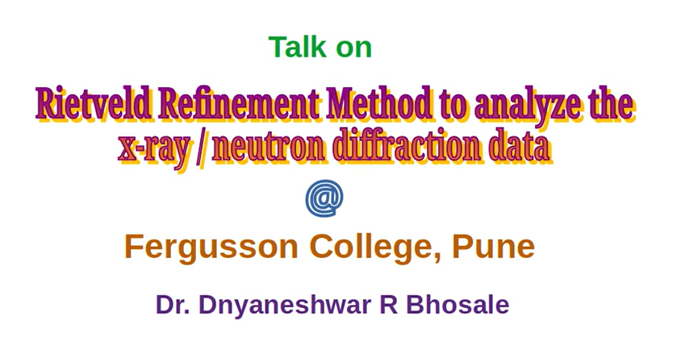
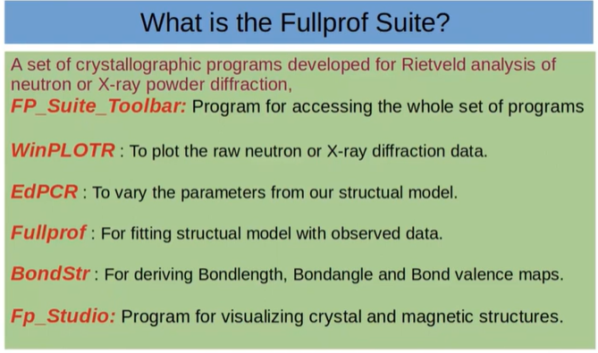
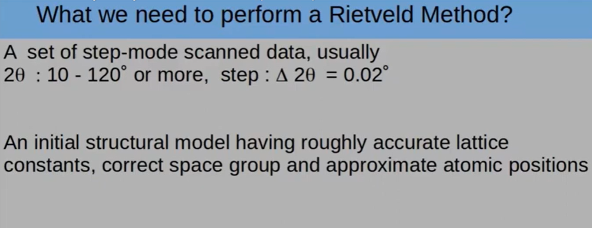
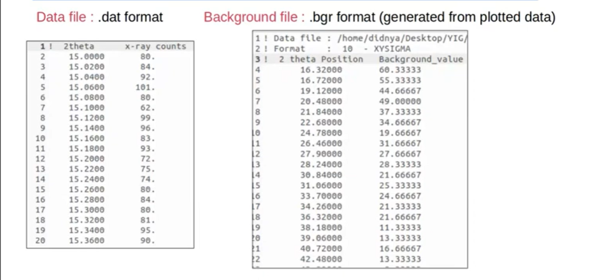
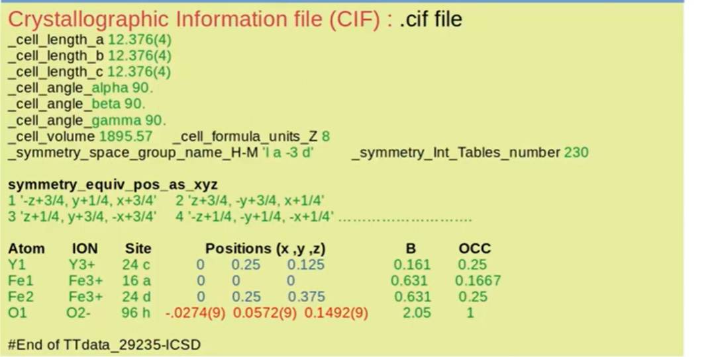
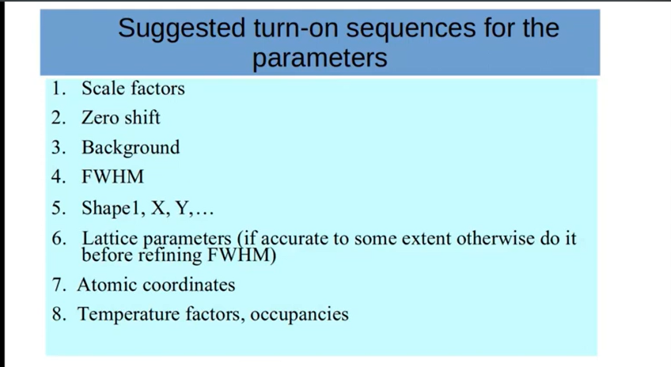

# Rietveld Refinement Method to analyze x - ray or neutron diffraction data (Session - II)

* Hands on practice session on Rietveld analysis of x-ray diffraction data for oxide materials

> We have Observed XRD data, we will analyze that, fit that data and we will  
> try to extract important information  

## What is the FullProf Suite?

## What we need to perform a Rietveld Method?

> .CIF will have already published info or some theoritically generated information for that particular compound

## Suggested turn-on sequences for the parameters

